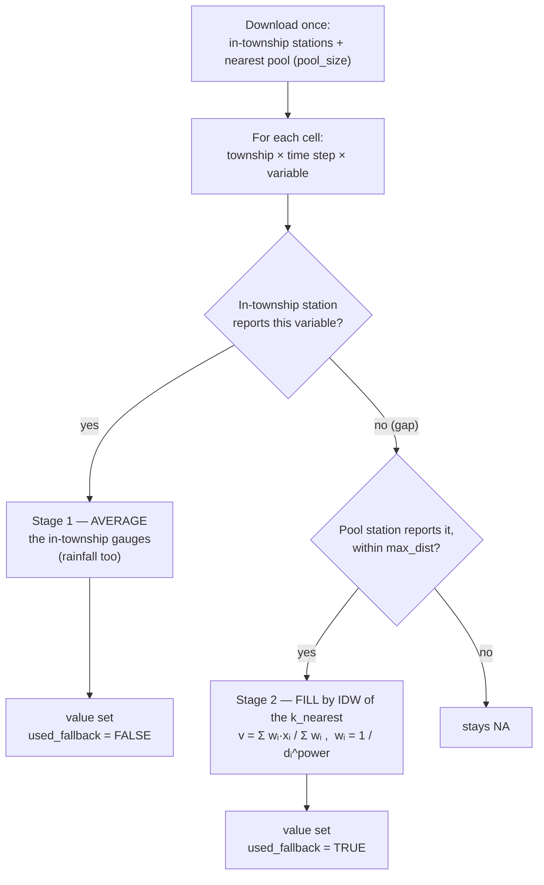

# twweather 

Download Taiwan historical weather observations from the NCHU
[*CWB Historical Weather Data Downloader*](https://mycolab.pp.nchu.edu.tw/historical_weather/index.php),
which redistributes Central Weather Administration (CWA / CODiS) station data.

The package gives you these functions:

| Function | Purpose |
|---|---|
| `get_stations()` | 測站基本資料 — station metadata (id, name, lon/lat, county) |
| `station_panel()` / `plot_station_panel()` | 營運狀態面板 — panelview-style station operating-status panel (Not yet established / Operating / Decommissioned) over a time window |
| `get_weather()` | 測量資料 — station observation time series (hourly / daily / monthly) |
| `get_township_weather()` | 內插到鄉鎮 — interpolate weather to township level by inverse-distance weighting (keyed on townid) |
| `get_region_weather()` | 內插到自訂區域 — interpolate weather over your own shapefile, keyed by one id column |

## Install

```r
# install.packages("remotes")
remotes::install_github("yyliou/weather")
```

Core functions need only `jsonlite`. The township function additionally needs
`sf` (`install.packages("sf")`).

The functions carry roxygen comments but the `man/*.Rd` help pages aren't
checked in. To build them (and pass `R CMD check`), run once:

```r
# install.packages("roxygen2")
roxygen2::roxygenise()    # or devtools::document()
```


## 1. Station metadata

```r
library(twweather)

st <- get_stations()
head(st[, c("station_id", "name", "county", "lon", "lat")])
```

Station metadata comes from the CODiS station list
(<https://codis.cwa.gov.tw/StationData>). All station types (`cwb` 局屬氣象站,
`agr` 農業站, automatic and rainfall stations, ...) are flattened into one tidy
table with at least `station_id`, `name`, `lon`, `lat`, plus `altitude`,
`county`, `address`, `area`, `attribute`, `start_date`, `end_date` and
`active`. By default only operating stations are returned; pass
`active_only = FALSE` to include decommissioned ones, or `raw = TRUE` to get the
provider's original columns untouched.

## 2. Station operating-status panel

A [panelview](https://yiqingxu.org/packages/panelView/)-style view of which
stations were operating over a window. Each station's `start_date` (set-up) and
`end_date` (decommission) classify every time step into one of three states —
`Not yet established`, `Operating` or `Decommissioned` — so you can see, at a
glance, when stations came online and when they were retired. The labels are in
English so the plot carries no Chinese text.

```r
# build the long status table: one row per station per period
p <- station_panel(start = "1990-01-01", end = "2024-12-31", by = "year")
table(p$status)

# plot it (needs ggplot2; in Suggests)
# install.packages("ggplot2")
plot_station_panel(start = "1990-01-01", end = "2024-12-31", by = "year")
```


- `by` is `"year"` (default), `"month"` or `"day"` — the time resolution of the
  columns. `start` / `end` accept `Date` objects or `YYYYMMDD` / `YYYY-MM-DD`
  strings.
- By default the metadata is fetched with `active_only = FALSE`, so
  decommissioned stations are kept (otherwise `Decommissioned` could never show
  up). Pass your own metadata to restrict the panel:

```r
st  <- get_stations(active_only = FALSE)
tp  <- st[st$county == "臺北市", ]
plot_station_panel(tp, start = "2000-01-01", end = "2024-12-31", by = "month")
```

- `plot_station_panel()` returns a normal `ggplot`, so you can keep styling it.
  Useful arguments: `sort` (`"start"` / `"duration"` / `"id"` / `"name"` /
  `"none"` — `"duration"` orders stations by how long they operated, longest at
  the top), `colors` (named vector for the three states), `label_col`
  (`"station_id"` or `"name"`) and `labels` (force the y-axis labels on/off).
  With many stations the y labels are hidden automatically (see `max_labels`).

A station with a missing set-up date is treated as "set up before the window"
and a missing decommission date as "still operating", so stations with unknown
dates default to `Operating` rather than dropping out of the plot.

## 3. Measurement data

```r
# one station, hourly
w <- get_weather("467490", "2024-01-01", "2024-01-07")

# several stations, daily (server returns a ZIP; combined automatically)
wd <- get_weather(c("466920", "466930"), "2024-01-01", "2024-01-31", type = "daily")
```

- `start` / `end` accept `Date` objects or `YYYYMMDD` / `YYYY-MM-DD` strings.
  `end` cannot be later than yesterday (the source truncates it).
- `type` is `"hourly"` (default), `"daily"` or `"monthly"`. Daily/monthly carry
  extra max/min/mean columns.
- A leading `station_id` column is always added; the original first column
  (observation time) is renamed `obs_time` and normalised to ISO format
  (`YYYY-MM-DD`, or `YYYY-MM` for monthly).
- With `clean = TRUE` (default), value columns are coerced to numeric and CODiS
  missing-value sentinels (e.g. `-99.8`, `-9999`, and literal text like `"NA"` /
  `"--"`) become `NA`.

## 4. Township values (average, then fill gaps)

A **hybrid** method, applied to every *township × time step × variable* cell:

1. **Average** the stations that fall inside the township (rainfall included —
   a mean of the in-township gauges).
2. If that cell is still empty — the township has no station of its own, or a
   variable its own stations never report (e.g. pressure in a rain-gauge-only
   district) — **fill** it by **inverse-distance weighting (IDW)** of the
   `k_nearest` surrounding stations that *do* report it (within `max_dist`, if
   set):

$$
v \;=\; \frac{\sum_i w_i\,x_i}{\sum_i w_i}, \qquad w_i = \frac{1}{d_i^{\,\text{power}}}
$$

where $d_i$ is the great-circle distance from the township's representative
point to station $i$. If no station reports the variable, the cell stays `NA`.



Only the in-township stations **plus a nearest pool** (`pool_size`) are
downloaded — not every station in the country — so asking for a handful of
townships is fast.

```r
# township boundaries as an sf layer. The default downloads the official NLSC
# 鄉鎮市區界線(TWD97經緯度) shapefile from data.gov.tw (dataset 7441); zipped
# shapefiles are unpacked automatically. Pass any sf-readable source to override.
bnd <- load_tw_townships()                 # or load_tw_townships("twtowns.shp")

# every township:
tw_all <- get_township_weather(
  start = "2024-01-01", end = "2024-01-07", type = "daily", boundaries = bnd
)

# just a couple of townships, selected by their townid codes:
tw <- get_township_weather(
  start = "2024-01-01", end = "2024-01-07", type = "daily",
  boundaries = bnd,
  townid     = c("66000040", "66000050"),   # omit to do every township
  power      = 2,                            # IDW exponent (gap fill)
  k_nearest  = 8,                            # nearest stations blended per gap
  max_dist   = NULL,                         # optional cap in km
  pool_size  = NULL                          # nearest pool to download; def max(30, 3*k)
)
```

Townships are keyed on **`townid`** — the official township code (`TOWNID` /
`TOWNCODE`) carried through from the boundary layer. A single code is
unambiguous, unlike district *names* which repeat across Taiwan (中山區 is in
both 臺北市 and 基隆市). The boundary layer must therefore include a township-code
column; `load_tw_townships()` keeps it for you.

Each requested township gets one row per time step (a **balanced, gap-free
panel**). A cell is empty only when no station within the pool (and `max_dist`,
if set) reports the variable at that time.

Output columns: `townid`, `county`, `township`, `obs_time`, one column per
variable, `n_stations` (in-township stations feeding the row) and
`used_fallback` (`TRUE` when any cell in the row was filled by IDW rather than
averaged). The IDW power is stored in `attr(tw, "power")` and the in-township
station ids in `attr(tw, "stations")`.

> **monthly note** — for `type = "monthly"` the end date is automatically
> extended to the end of its month, because the source returns a month's record
> only once the window reaches the month end (a sub-month window comes back
> empty — which previously surfaced as all-`NA`).

You can also use the building blocks directly:

```r
st  <- get_stations()
st  <- assign_township(st, bnd)            # adds township / county_geo / townid
```

### Speeding up many townships

For a few townships the download is small. For **all ~368**, the nearest pools
overlap so much that you end up downloading almost every station anyway, and the
time goes into downloading and parsing those CSVs — not the interpolation. Two
levers:

- **Faster parsing (automatic).** If the suggested [`data.table`](https://cran.r-project.org/package=data.table)
  package is installed, CSV parsing uses `data.table::fread` (much faster on the
  wide feed); otherwise a base-R parser is used. Nothing to configure —
  `install.packages("data.table")` and the first run is quicker.
- **Download once, reuse via `obs=`.** Boundaries and historical observations
  don't change, so fetch the data once, cache it, and pass it back. Subsequent
  runs (different `townid` subsets, `power`, `k_nearest`, …) skip the network
  entirely:

  ```r
  stations <- get_stations()
  # one download covering every station you might need:
  obs <- get_weather(stations$station_id, "2024-01-01", "2024-01-07",
                     type = "daily")
  saveRDS(list(stations = stations, obs = obs), "cwa_2024w1.rds")   # cache

  # later / repeatedly — no download, runs in seconds:
  cache <- readRDS("cwa_2024w1.rds")
  tw <- get_township_weather(
    start = "2024-01-01", end = "2024-01-07", type = "daily",
    boundaries = bnd, stations = cache$stations, obs = cache$obs
  )
  ```

  Pass the **same `stations`** table you built `obs` from so coordinates line
  up. `get_region_weather()` takes `obs=` too.

## 5. Your own shapefile

**The algorithm is exactly the same as section 4** (average inside each region,
then IDW-fill the gaps — diagram and formula above apply unchanged). The only
differences are *what you aggregate to* and *how regions are keyed*:

| | section 4 `get_township_weather()` | section 5 `get_region_weather()` |
|---|---|---|
| polygons | official township layer (`boundaries`) | **your own** `sf` / shapefile (`shp`) |
| region key | `townid` (built in) | a column **you name** via `id_field` |
| output key column | `townid` + `county` + `township` | `region` (your `id_field` values) |

So `get_region_weather()` is just `get_township_weather()` pointed at arbitrary
polygons: you supply the geometry (`shp`) and tell it which attribute column
labels each polygon (`id_field`). Everything downstream — average, gap-fill,
`power` / `k_nearest` / `max_dist` / `pool_size`, the balanced panel — is
identical.

```r
rw <- get_region_weather(
  start = "2024-01-01", end = "2024-01-07", type = "daily",
  shp      = "my_regions.shp",   # or an sf object you already loaded
  id_field = "site_name",        # the column that names each region
  regions  = NULL,               # optional subset of id_field values to keep
  power = 2, k_nearest = 8, max_dist = NULL, pool_size = NULL
)
```

Output columns: `region` (your `id_field` values), `obs_time`, one column per
variable, `n_stations` and `used_fallback`. Polygons that share an `id_field`
value are unioned and treated as a single region.

## Notes

- Station metadata comes from the CODiS `station_list` endpoint
  (<https://codis.cwa.gov.tw/api/station_list>); if that endpoint moves, pass
  your own `url=` to `get_stations()`.
- Township boundaries are **not** bundled. `load_tw_townships()` defaults to the
  official NLSC 鄉鎮市區界線(TWD97經緯度) shapefile on data.gov.tw
  (<https://data.gov.tw/dataset/7441>) and unpacks the zip for you. That download
  URL embeds a release date and changes occasionally — if it 404s, grab the
  current SHP link from the dataset page (or a local copy) and pass it via
  `source=`.
- Data source & terms: CWA CODiS via
  <https://mycolab.pp.nchu.edu.tw/historical_weather/>.

## License

MIT
